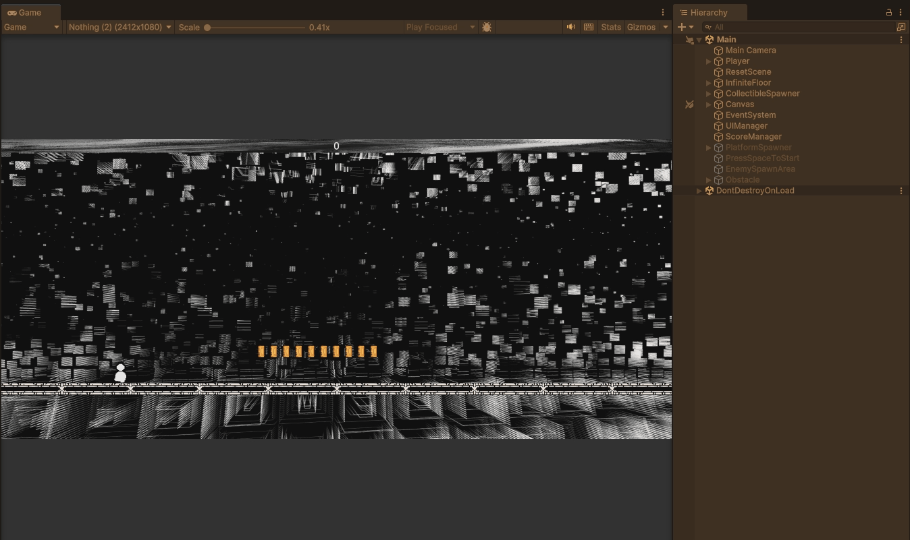
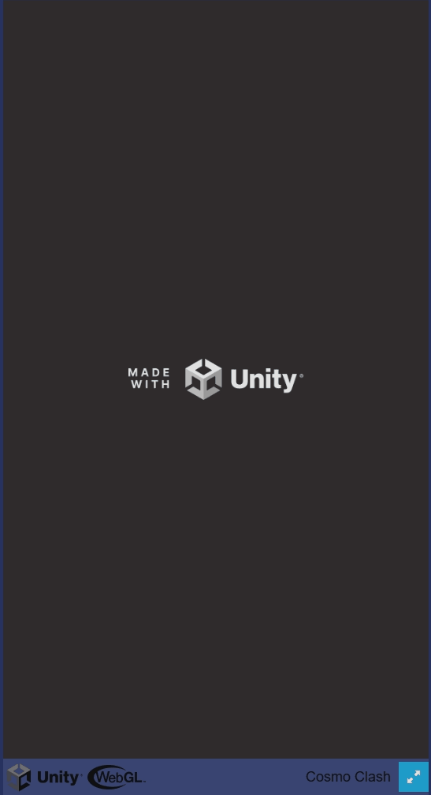

```Descriptions created with the help of generative AI```

🏃 Endless Runner – Jump, Score, Animation Transition


🕹 Smooth jump with gravity-based falling

🎞 Run → Jump → Fall using Unity Animator with blend states

💰 Score increases when player picks up items (trigger-based)

📊 Score display in the game HUD

🔧 Built with Unity (C#)
🧩 Rigidbody2D, Animator, Canvas UI, OnTriggerEnter2D, Object Pooling (Coins)

---

🚀 Cosmo Clash – Space Shooter Demo  


🕹 Vertical scrolling space shooter 

💥 Bullets fired upward from player ship (auto fire)

🎯 Enemies are destroyed on hit – basic hitbox collision system

🔥 Visual feedback on impact (flash or explosion effect)

🔧 Built with Unity (C#)  
🧩 Rigidbody2D, Collider2D, Projectile script, Enemy spawner, OnTriggerEnter2D, Object Pooling (Enemies, Ammunition)

---

🧊 SliderBoi – Obstacle Dodging with Score


🕹 Obstacle dodging on a 3D endless track

🎮 Player moves left/right to avoid incoming objects

📏 Score system based on distance traveled and number of collected diamonds

🌈 Minimalist low-poly aesthetic with vibrant colors

🔧 Built with Unity (C#)  
🧩 Rigidbody, Obstacle Spawner, Score Counter, Input Controller
