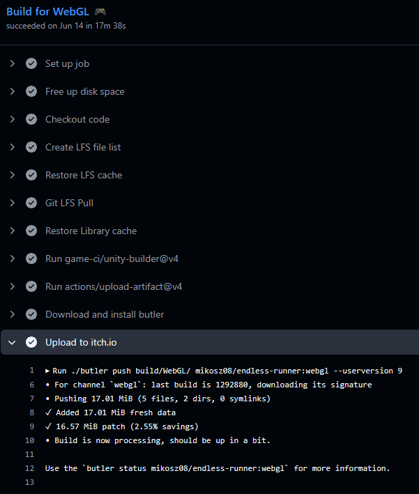
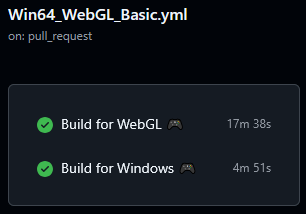
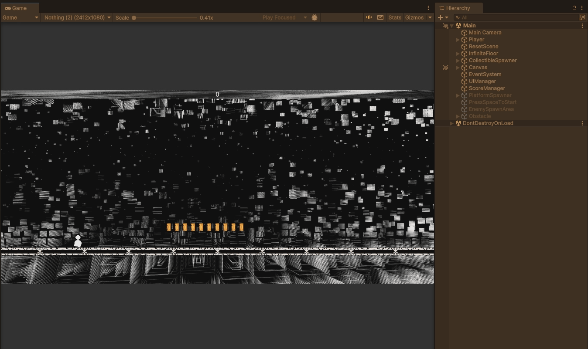

```Works in endless progress```

# Game Prototypes and CI/CD Workflows

This repository contains several examples of my Unity game prototypes and an automated build workflow using GitHub Actions. Below you will find highlights of the projects and screenshots of the build pipelines.

---

## Continuous Integration / Deployment Workflow

My GitHub Action workflow to automatically build and deploy the game to multiple platforms. Below are screenshots of a successful build and deployment pipeline.

### WebGL Build & Upload to Itch.io


- Automatically builds the WebGL target using Unity
- Pushes build to Itch.io using Butler CLI
- Shows patch size and upload status in logs

### Windows and WebGL Parallel Builds


- `Win64_WebGL_Basic.yml` handles both WebGL and Windows builds
- Runs on pull requests to ensure builds are always green
- Total build times shown for quick reference

---

**Technologies Used:**
- Unity (C#)
- GitHub Actions for CI/CD
- Butler for Itch.io deployment

Feel free to explore the workflow files (`.github/workflows/*.yml`) to see how multi-platform automation is configured.

---

## Endless Runner – Jump, Score, Animation Transition


- Smooth jump with gravity-based falling
- Run → Jump → Fall using Unity Animator with blend states
- Score increases when player picks up items (trigger-based)
- Score display in the HUD
- Built with Unity (C#) using Rigidbody2D, Animator, Canvas UI, OnTriggerEnter2D, Object Pooling (Coins)

---

## Cosmo Clash – Space Shooter Demo


- Vertical scrolling space shooter
- Bullets fired upward from player ship (auto fire)
- Enemies are destroyed on hit – basic hitbox collision system
- Visual feedback on impact (flash or explosion effect)
- Built with Unity (C#) using Rigidbody2D, Collider2D, Projectile script, Enemy spawner, OnTriggerEnter2D, Object Pooling (Enemies, Ammunition)

---

## SliderBoi – Obstacle Dodging with Score


- Obstacle dodging on a 3D endless track
- Player moves left/right to avoid incoming objects
- Score system based on distance traveled and collected diamonds
- Minimalist low-poly aesthetic with vibrant colors
- Built with Unity (C#) using Rigidbody, Obstacle Spawner, Score Counter, Input Controller

---


